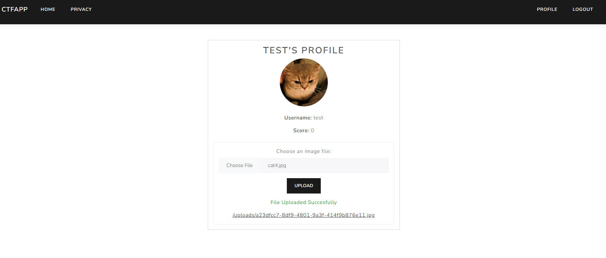

# CTFApp - A Vulnerable Web Application  

CTFApp is a simple vulnerable web application designed for beginners to practice ethical hacking techniques. It provides an environment for learning common web vulnerabilities in a black-box testing approach.

## Installation  

### 1. Clone the repository  
```bash  
git clone https://github.com/Tr0x69/CTFApp 
cd CTFApp 
```

### 2. Build and run the application using Docker  
```bash  
docker-compose up -d  
```

### 3. Access the application  
Once the container is running, you can access the application at:  
```
http://localhost:PORT  
```
*(Replace `PORT` with the actual port specified in your `docker-compose.yml` file.)*


## Recommended Testing Approach  

To get the best experience, use **black-box testing** techniques. Assume no prior knowledge of the source code and test the application as an attacker would.  

### Common Vulnerabilities to Explore  
- SQL Injection  
- Cross-Site Scripting (XSS)  
- Broken Authorization  
- Server-Side Request Forgery (SSRF)
- Insecure Direct Object References (IDOR)  

**Disclaimer:** This project is for educational purposes only.

  

  

 

Happy Hacking! 🛡️
